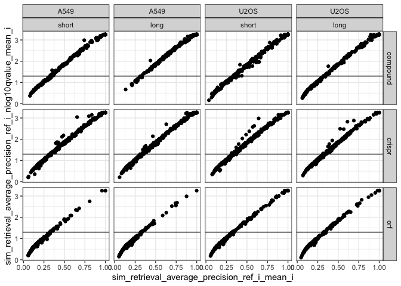

Inspect metrics
================

``` r
library(tidyverse)
library(glue)
library(logger)
```

``` r
type <- params$background_type
```

``` r
metric_set <- glue("level_1_0_{type}_null_adjusted")

parquet_file <-
  with(
    params,
    glue("{input_metrics_file_prefix}_{metric_set}.parquet")
  )

log_info("Reading {parquet_file} ...")

level_1_0_metrics_null_adjusted <-
  arrow::read_parquet(glue(parquet_file))

all_same_cols_rep <- attr(level_1_0_metrics_null_adjusted, "all_same_cols_rep")
```

After reading level_1, drop duplicates that may result from annotating
level 1_0 entities

``` r
metric_set <- glue("level_1_{type}_null_adjusted")

parquet_file <-
  with(
    params,
    glue("{input_metrics_file_prefix}_{metric_set}.parquet")
  )

log_info("Reading {parquet_file} ...")

level_1_metrics_null_adjusted <-
  arrow::read_parquet(glue(parquet_file)) %>%
  select(all_of(all_same_cols_rep), matches("^sim_")) %>%
  distinct()
```

``` r
significance_threshold <-
  attr(level_1_0_metrics_null_adjusted, "significance_threshold")

significance_threshold
```

    ## [1] 0.05

``` r
metric_list <-
  c(
    glue("sim_retrieval_average_precision_{type}_i_mean_i"),
    glue("sim_retrieval_average_precision_{type}_i_nlog10pvalue_mean_i")
  )
```

``` r
level_1_metrics_null_adjusted <-
  level_1_metrics_null_adjusted %>%
  select(matches("Metadata_"), one_of(metric_list)) %>%
  select(-Metadata_control_type, -Metadata_reference_or_other)
```

``` r
level_1_metrics_null_adjusted %>%
  count(Metadata_Perturbation, Metadata_Cell_type, Metadata_Time, Metadata_broad_sample) %>%
  filter(n > 1)
```

``` r
level_1_metrics_null_adjusted %>%
  ungroup() %>%
  slice_sample(n = 10) %>%
  rename(
    mAP = sim_retrieval_average_precision_ref_i_mean_i,
    mAP_neglog10_pvalue = sim_retrieval_average_precision_ref_i_nlog10pvalue_mean_i
  )
```

<div class="kable-table">

| Metadata_Perturbation | Metadata_Cell_type | Metadata_Time | Metadata_target_list | Metadata_broad_sample  |       mAP | mAP_neglog10_pvalue |
|:----------------------|:-------------------|:--------------|:---------------------|:-----------------------|----------:|--------------------:|
| orf                   | A549               | 48            | TGM2                 | ccsbBroad304_07061     | 0.1956850 |           0.8934761 |
| compound              | A549               | 48            | PDE7A                | BRD-A00827783-001-24-6 | 0.2790796 |           1.2367359 |
| compound              | U2OS               | 48            | ATP5F1D              | BRD-A51831848-001-01-7 | 0.0730904 |           0.3330118 |
| crispr                | U2OS               | 144           | COMT                 | BRDN0001487915         | 0.6006944 |           2.5768233 |
| orf                   | A549               | 96            | ATP5F1D              | ccsbBroad304_00129     | 0.0732142 |           0.2952519 |
| orf                   | U2OS               | 96            | IL1B                 | ccsbBroad304_00843     | 0.1141790 |           0.5366849 |
| orf                   | A549               | 48            | CDK2                 | ccsbBroad304_14572     | 0.2064575 |           1.0046096 |
| compound              | A549               | 24            | KCNN4                | BRD-K48278478-001-01-2 | 0.3236117 |           1.3960526 |
| crispr                | A549               | 96            | CA5A                 | BRDN0001486451         | 1.0000000 |           4.0000434 |
| orf                   | A549               | 96            | AKR1C1               | ccsbBroad304_06088     | 0.3205837 |           1.5232936 |

</div>

``` r
level_1_metrics_null_adjusted <-
  level_1_metrics_null_adjusted %>%
  inner_join(
    level_1_metrics_null_adjusted %>%
      distinct(Metadata_Perturbation, Metadata_Time) %>%
      arrange(Metadata_Perturbation, Metadata_Time) %>%
      group_by(Metadata_Perturbation) %>%
      mutate(Metadata_Time_coded = rank(Metadata_Time)) %>%
      ungroup() %>%
      mutate(Metadata_Time_coded = factor(
        Metadata_Time_coded, labels = c("short", "long")
      ))
  )
```

    ## Joining with `by = join_by(Metadata_Perturbation, Metadata_Time)`

``` r
level_1_metrics_null_adjusted %>%
  ggplot(aes(sim_retrieval_average_precision_ref_i_mean_i,
             sim_retrieval_average_precision_ref_i_nlog10pvalue_mean_i)) +
  geom_point() +
  facet_grid(Metadata_Perturbation ~ Metadata_Cell_type + Metadata_Time_coded) +
  geom_hline(yintercept = -log10(significance_threshold)) +
  theme_bw()
```

<!-- -->
