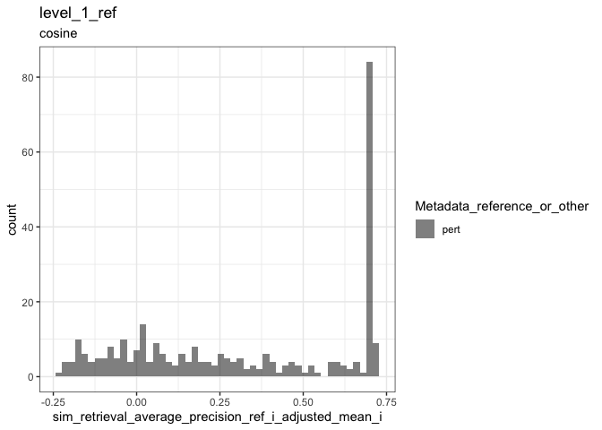
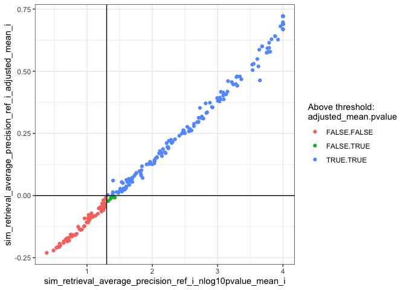
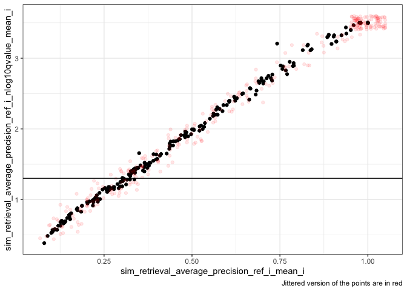
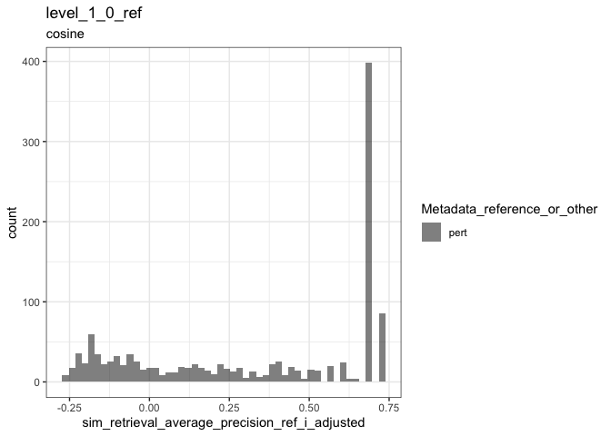
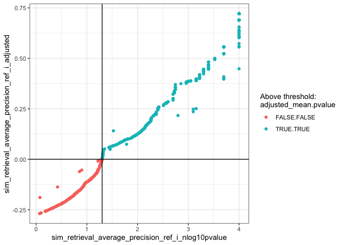
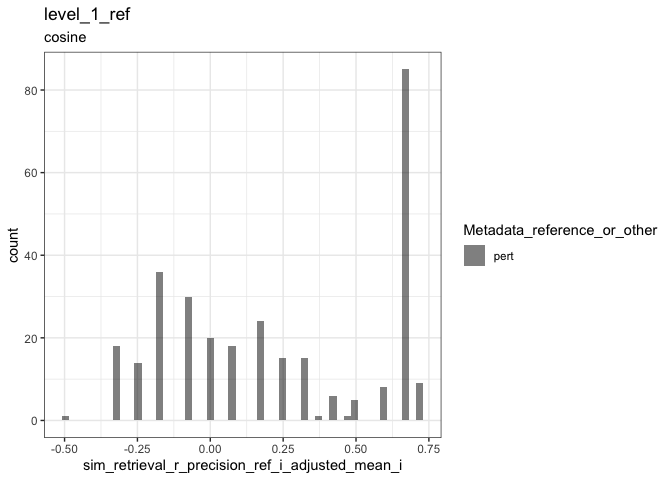
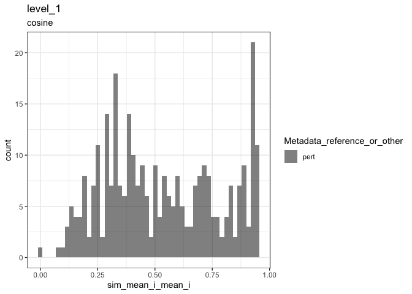
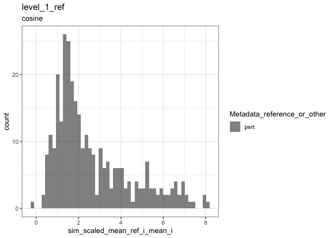
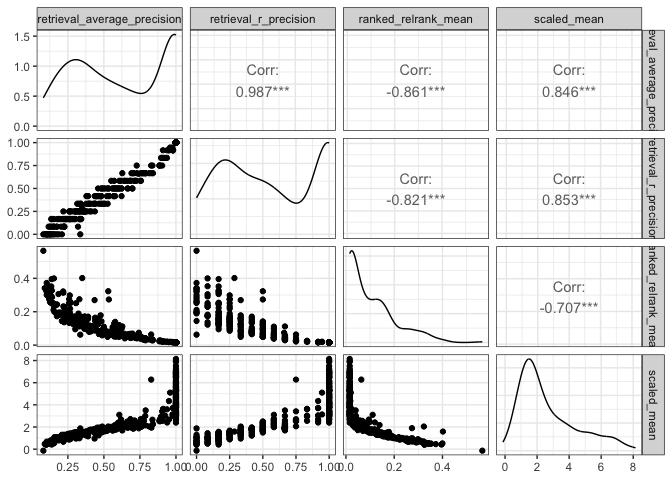
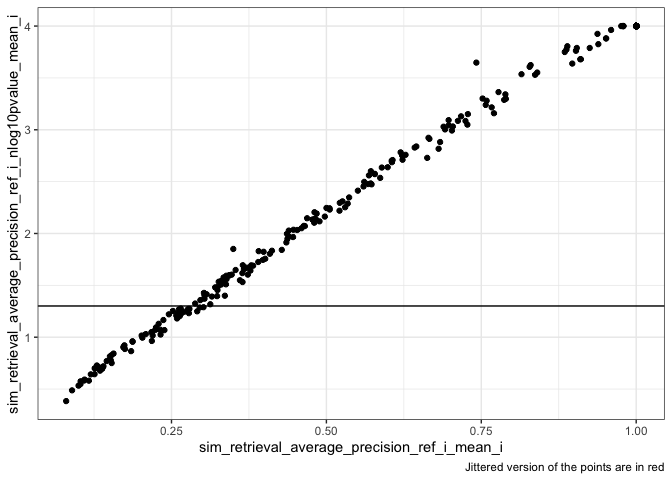

Inspect metrics
================

- <a href="#1-setup" id="toc-1-setup">1 Setup</a>
- <a href="#2-functions" id="toc-2-functions">2 Functions</a>
- <a href="#3-read" id="toc-3-read">3 Read</a>
- <a href="#4-plot-metrics" id="toc-4-plot-metrics">4 Plot metrics</a>
  - <a href="#41-average-precision" id="toc-41-average-precision">4.1
    Average Precision</a>
    - <a href="#411-level-1" id="toc-411-level-1">4.1.1 Level 1</a>
    - <a href="#412-level-1_0" id="toc-412-level-1_0">4.1.2 Level 1_0</a>
  - <a href="#42-r-precision" id="toc-42-r-precision">4.2 R-precision</a>
    - <a href="#421-level-1" id="toc-421-level-1">4.2.1 Level 1</a>
  - <a href="#43-other-metrics" id="toc-43-other-metrics">4.3 Other
    metrics</a>
    - <a href="#431-mean-pairwise-similarity"
      id="toc-431-mean-pairwise-similarity">4.3.1 Mean pairwise similarity</a>
    - <a href="#432-grit" id="toc-432-grit">4.3.2 Grit</a>
    - <a href="#433-pairwise-scatter-plots"
      id="toc-433-pairwise-scatter-plots">4.3.3 Pairwise scatter plots</a>
  - <a href="#44-label-groups" id="toc-44-label-groups">4.4 Label groups</a>

# 1 Setup

``` r
library(magrittr)
library(tidyverse)
library(glue)
library(arrow)
library(matric)
library(logger)
source("utils.R")
```

``` r
type <- params$background_type
```

# 2 Functions

``` r
plot_metric <-
  function(metrics,
           metric_name,
           plot_title,
           plot_subtitle) {
    color_map <- c(
      "reference" = "red",
      "pert" = "black"
    )

    metric_sym <- sym(metric_name)

    p <-
      metrics %>%
      mutate(point_order = as.numeric(
        factor(
          Metadata_reference_or_other,
          levels = c("reference", "pert"),
          ordered = TRUE
        )
      )) %>%
      arrange(desc(point_order)) %>%
      ggplot(aes(!!metric_sym,
        fill = Metadata_reference_or_other
      )) +
      geom_histogram(
        position = "identity",
        alpha = 0.5,
        bins = 50
      ) +
      scale_fill_manual(values = color_map) +
      ggtitle(plot_title, subtitle = plot_subtitle) +
      theme(legend.position = "bottom") +
      theme_bw()

    list(fig1 = p)
  }
```

# 3 Read

``` r
metric_set <- glue("level_1_0_{type}_null_adjusted")

parquet_file <-
  with(
    params,
    glue("{input_metrics_file_prefix}_{metric_set}.parquet")
  )

log_info("Reading {parquet_file} ...")

level_1_0_metrics_null_adjusted <-
  arrow::read_parquet(glue(parquet_file))

all_same_cols_rep <- attr(level_1_0_metrics_null_adjusted, "all_same_cols_rep")
```

After reading level_1, drop duplicates that may result from annotating
level 1_0 entities

``` r
metric_set <- glue("level_1_{type}_null_adjusted")

parquet_file <-
  with(
    params,
    glue("{input_metrics_file_prefix}_{metric_set}.parquet")
  )

log_info("Reading {parquet_file} ...")

level_1_metrics_null_adjusted <-
  arrow::read_parquet(glue(parquet_file)) %>%
  select(all_of(all_same_cols_rep), matches("^sim_")) %>%
  distinct()
```

``` r
significance_threshold <-
  attr(level_1_0_metrics_null_adjusted, "significance_threshold")
```

# 4 Plot metrics

## 4.1 Average Precision

### 4.1.1 Level 1

``` r
result <-
  plot_metric(
    level_1_metrics_null_adjusted,
    glue("sim_retrieval_average_precision_{type}_i_adjusted_mean_i"),
    glue("level_1_{type}"),
    attr(level_1_metrics_null_adjusted, "metric_metadata")$method
  )
result$fig1
```

<!-- -->

#### 4.1.1.1 Compare p-value threshold and adjusted metric

``` r
level_1_metrics_null_adjusted %>%
  mutate(
    above_threshold_adjusted_mean =
      (.data[[glue("sim_retrieval_average_precision_{type}_i_adjusted_mean_i")]] > 0)
  ) %>%
  mutate(
    above_threshold_nlog10pvalue =
      (.data[[glue("sim_retrieval_average_precision_{type}_i_nlog10pvalue_mean_i")]] > -log10(significance_threshold))
  ) %>%
  ggplot(aes_string(
    glue(
      "sim_retrieval_average_precision_{type}_i_nlog10pvalue_mean_i"
    ),
    glue("sim_retrieval_average_precision_{type}_i_adjusted_mean_i")
  )) +
  geom_point(aes(color = interaction(above_threshold_adjusted_mean, above_threshold_nlog10pvalue))) +
  geom_hline(yintercept = 0) +
  geom_vline(xintercept = -log10(significance_threshold)) +
  guides(color = guide_legend(title = "Above threshold:\nadjusted_mean.pvalue")) +
  theme_bw()
```

    ## Warning: `aes_string()` was deprecated in ggplot2 3.0.0.
    ## ℹ Please use tidy evaluation ideoms with `aes()`

<!-- -->

``` r
level_1_metrics_null_adjusted %>%
  mutate(
    above_threshold =
      .data[[glue("sim_retrieval_average_precision_{type}_i_adjusted_mean_i")]] > 0
  ) %>%
  count(above_threshold)
```

<div class="kable-table">

| above_threshold |   n |
|:----------------|----:|
| FALSE           |  71 |
| TRUE            | 235 |

</div>

Thresholding based on average p-value will give similar but not
identical results

``` r
level_1_metrics_null_adjusted %>%
  mutate(
    above_threshold =
      .data[[glue("sim_retrieval_average_precision_{type}_i_nlog10pvalue_mean_i")]] > -log10(significance_threshold)
  ) %>%
  count(above_threshold)
```

<div class="kable-table">

| above_threshold |   n |
|:----------------|----:|
| FALSE           |  65 |
| TRUE            | 241 |

</div>

Thresholding based on FDR-adjusted p-value

``` r
level_1_metrics_null_adjusted %>%
  mutate(
    above_threshold =
      .data[[glue("sim_retrieval_average_precision_{type}_i_nlog10qvalue_mean_i")]] > -log10(significance_threshold)
  ) %>%
  count(above_threshold)
```

<div class="kable-table">

| above_threshold |   n |
|:----------------|----:|
| FALSE           |  74 |
| TRUE            | 232 |

</div>

#### 4.1.1.2 Statistic vs p-value

``` r
p <-
  level_1_metrics_null_adjusted %>%
  ggplot(aes_string(
    glue("sim_retrieval_average_precision_{type}_i_mean_i"),
    glue("sim_retrieval_average_precision_{type}_i_nlog10pvalue_mean_i")
  )) +
  geom_jitter(height = 0.1, width = 0.05, alpha = 0.1, color = "red") +
  geom_point(aes(
    text = names(level_1_metrics_null_adjusted) %>% str_subset("Metadata") %>% map_chr(function(x) {
      sprintf("{%s}", x)
    }) %>% paste(collapse = ":") %>% glue()
  )) +
  geom_hline(yintercept = -log10(significance_threshold)) +
  theme_bw() +
  labs(caption = "Jittered version of the points are in red")
```

    ## Warning in geom_point(aes(text = names(level_1_metrics_null_adjusted) %>% : Ignoring unknown aesthetics: text

``` r
p
```

<!-- -->

``` r
l <- plotly::ggplotly(p)

htmlwidgets::saveWidget(l, with(params, glue("{input_metrics_file_prefix}_plot_level_1_pvalue.html")))
```

``` r
p <-
  level_1_metrics_null_adjusted %>%
  ggplot(aes_string(
    glue("sim_retrieval_average_precision_{type}_i_mean_i"),
    glue(
      "sim_retrieval_average_precision_{type}_i_nlog10qvalue_mean_i"
    )
  )) +
  geom_point(aes(
    text = names(level_1_metrics_null_adjusted) %>% str_subset("Metadata") %>% map_chr(function(x) {
      sprintf("{%s}", x)
    }) %>% paste(collapse = ":") %>% glue()
  )) +
  geom_jitter(height = 0.1, width = 0.05, alpha = 0.1, color = "red") +
  geom_hline(yintercept = -log10(significance_threshold)) +
  theme_bw() +
  labs(caption = "Jittered version of the points are in red")
```

    ## Warning in geom_point(aes(text = names(level_1_metrics_null_adjusted) %>% : Ignoring unknown aesthetics: text

``` r
p
```

<!-- -->

``` r
l <- plotly::ggplotly(p)

htmlwidgets::saveWidget(l, with(params, glue("{input_metrics_file_prefix}_plot_level_1_qvalue.html")))
```

### 4.1.2 Level 1_0

``` r
result <-
  plot_metric(
    level_1_0_metrics_null_adjusted,
    glue("sim_retrieval_average_precision_{type}_i_adjusted"),
    glue("level_1_0_{type}"),
    attr(level_1_metrics_null_adjusted, "metric_metadata")$method
  )
result$fig1
```

<!-- -->

#### 4.1.2.1 Compare p-value threshold and adjusted metric

``` r
level_1_0_metrics_null_adjusted %>%
  mutate(
    above_threshold_adjusted_mean =
      (.data[[glue("sim_retrieval_average_precision_{type}_i_adjusted")]] > 0)
  ) %>%
  mutate(
    above_threshold_nlog10pvalue =
      (.data[[glue("sim_retrieval_average_precision_{type}_i_nlog10pvalue")]] > -log10(significance_threshold))
  ) %>%
  ggplot(aes_string(
    glue(
      "sim_retrieval_average_precision_{type}_i_nlog10pvalue"
    ),
    glue("sim_retrieval_average_precision_{type}_i_adjusted")
  )) +
  geom_point(aes(color = interaction(above_threshold_adjusted_mean, above_threshold_nlog10pvalue))) +
  geom_hline(yintercept = 0) +
  geom_vline(xintercept = -log10(significance_threshold)) +
  guides(color = guide_legend(title = "Above threshold:\nadjusted_mean.pvalue")) +
  theme_bw()
```

<!-- -->

``` r
level_1_0_metrics_null_adjusted %>%
  mutate(
    above_threshold =
      .data[[glue("sim_retrieval_average_precision_{type}_i_adjusted")]] > 0
  ) %>%
  count(above_threshold)
```

<div class="kable-table">

| above_threshold |   n |
|:----------------|----:|
| FALSE           | 367 |
| TRUE            | 912 |

</div>

## 4.2 R-precision

### 4.2.1 Level 1

``` r
result <-
  plot_metric(
    level_1_metrics_null_adjusted,
    glue("sim_retrieval_r_precision_{type}_i_adjusted_mean_i"),
    glue("level_1_{type}"),
    attr(level_1_metrics_null_adjusted, "metric_metadata")$method
  )
result$fig1
```

<!-- -->

``` r
level_1_metrics_null_adjusted %>%
  mutate(
    above_threshold =
      .data[[glue("sim_retrieval_r_precision_{type}_i_adjusted_mean_i")]] > 0
  ) %>%
  count(above_threshold)
```

<div class="kable-table">

| above_threshold |   n |
|:----------------|----:|
| FALSE           | 119 |
| TRUE            | 187 |

</div>

## 4.3 Other metrics

### 4.3.1 Mean pairwise similarity

``` r
result <-
  plot_metric(
    level_1_metrics_null_adjusted,
    "sim_mean_i_mean_i",
    "level_1",
    attr(level_1_metrics_null_adjusted, "metric_metadata")$method
  )
result$fig1
```

<!-- -->

### 4.3.2 Grit

``` r
result <-
  plot_metric(
    level_1_metrics_null_adjusted,
    glue("sim_scaled_mean_{type}_i_mean_i"),
    glue("level_1_{type}"),
    attr(level_1_metrics_null_adjusted, "metric_metadata")$method
  )
result$fig1
```

<!-- -->

### 4.3.3 Pairwise scatter plots

``` r
level_1_metrics_null_adjusted %>%
  select(all_of(c(
    glue("sim_retrieval_average_precision_{type}_i_mean_i"),
    glue("sim_retrieval_r_precision_{type}_i_mean_i"),
    glue("sim_ranked_relrank_mean_{type}_i_mean_i"),
    glue("sim_scaled_mean_{type}_i_mean_i")
  ))) %>%
  rename_with(~ str_remove_all(., glue("sim_|_{type}_i_mean_i")), matches("sim_")) %>%
  GGally::ggpairs(progress = FALSE) +
  theme_bw()
```

    ## Registered S3 method overwritten by 'GGally':
    ##   method from   
    ##   +.gg   ggplot2

<!-- -->

## 4.4 Label groups

``` r
label_name <-
  attr(level_1_metrics_null_adjusted, "params")$calculate_index$sim_params$all_same_cols_rep[1]


p <-
  level_1_metrics_null_adjusted %>%
  ggplot(aes(.data[[glue("sim_retrieval_average_precision_{type}_i_mean_i")]],
    .data[[glue("sim_retrieval_average_precision_{type}_i_nlog10pvalue_mean_i")]],
    label = sprintf(
      "%s(%s)",
      .data[[label_name]],
      .data[[glue("sim_stat_signal_n_{type}_i_mean_i")]]
    )
  )) +
  geom_point() +
  ggrepel::geom_text_repel(
    data = level_1_metrics_null_adjusted %>%
      filter(.data[[glue("sim_retrieval_average_precision_{type}_i_nlog10pvalue_mean_i")]] > -log10(significance_threshold)),
    max.overlaps = 10
  ) +
  geom_hline(yintercept = -log10(significance_threshold)) +
  theme_bw() +
  labs(caption = "Jittered version of the points are in red")

p
```

    ## Warning: ggrepel: 241 unlabeled data points (too many overlaps). Consider increasing max.overlaps

<!-- -->
